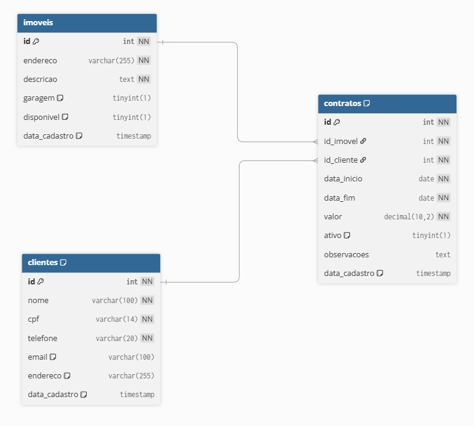

# trabalho01-poo2
Repositório pro primeiro trabalho de POO2

# Conexão banco
Os dados da conexão com o banco de dados estão no [ConnectionFactory.java](src/main/java/dev/trabalho/dao/ConnectionFactory.java)

# Script SQL
O script sql está localizado na [pasta resources](src/main/resources/imobiliaria.sql)

# Diagrama MER

# Diagrama de Classes

